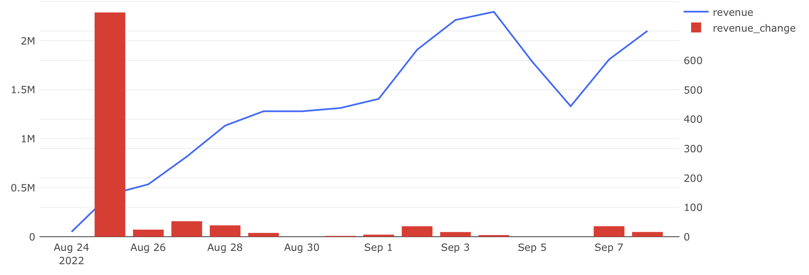
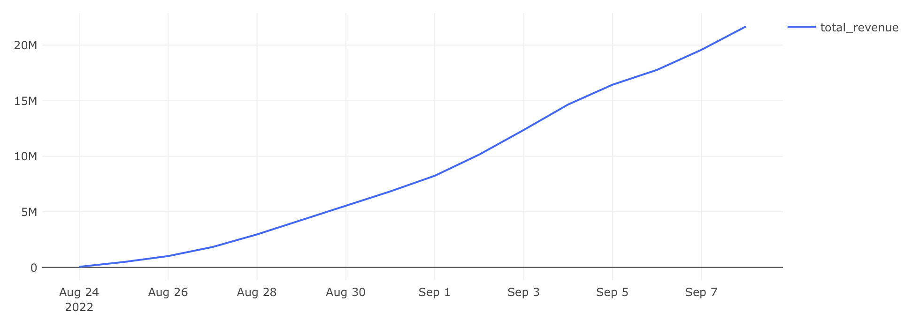

# Экономика продукта — Задача 1

## Выручка по дням

**Цель:**  
Рассчитать ежедневную и суммарную выручку сервиса, а также динамику прироста выручки по дням.

---

## Задача

Для каждого дня в таблице `orders` необходимо:

- Посчитать **выручку**, полученную в этот день;
- Посчитать **суммарную выручку** на текущий день;
- Определить **прирост выручки** относительно предыдущего дня.

### Требуемые поля:

- `date` — дата оформления заказа;
- `revenue` — выручка за день;
- `total_revenue` — накопленная выручка;
- `revenue_change` — изменение выручки относительно предыдущего дня, %.

---

## Подход

- Выручка считается как сумма стоимости всех товаров по заказу.
- Учитываются только **неотменённые** заказы.
- Для расчёта доли использована оконная функция `LAG()` и агрегатная функция `SUM()`.

---

## SQL-запрос

```sql
WITH orders_product_id AS (
    SELECT creation_time,
           order_id,
           unnest(product_ids) AS product_id
    FROM orders
    WHERE order_id NOT IN (
        SELECT order_id FROM user_actions WHERE action = 'cancel_order'
    )
), revenue_t AS (
    SELECT date,
           SUM(order_price) AS revenue
    FROM (
        SELECT creation_time::date AS date,
               order_id,
               SUM(price) AS order_price
        FROM (
            SELECT creation_time,
                   order_id,
                   l.product_id AS product_id,
                   price
            FROM orders_product_id AS l
            LEFT JOIN products AS r ON l.product_id = r.product_id
        ) t1
        GROUP BY date, order_id
    ) t2
    GROUP BY date
    ORDER BY date
)
SELECT date,
       revenue,
       SUM(revenue) OVER (ORDER BY date) AS total_revenue,
       ROUND(
         (revenue - LAG(revenue) OVER (ORDER BY date)::numeric) /
         LAG(revenue) OVER (ORDER BY date) * 100,
         2
       ) AS revenue_change
FROM revenue_t
ORDER BY date
```

## Визуализация

**Динамика ежедневной выручки:**



**Динамика общей выручки:**



## Выводы

- Выручка растёт стабильно, но прирост с каждым днём становится менее выраженным.
- Резкий всплеск наблюдается в первые дни, что может быть связано с маркетинговыми активностями.
- Несколько дней фиксируется падение выручки.
