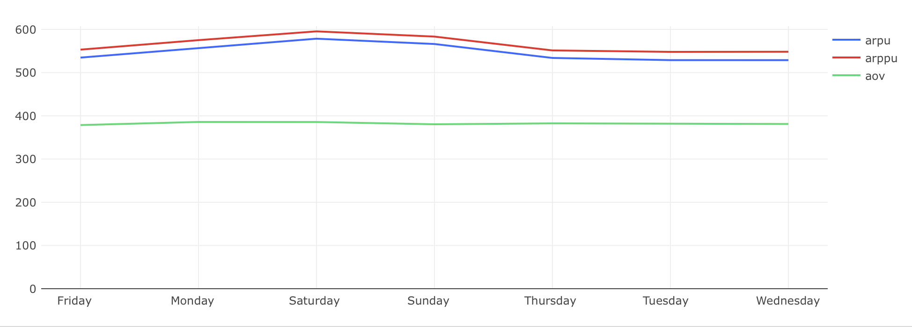

# Экономика продукта — Задача 3

## Накопленные метрики выручки: Running ARPU, ARPPU, AOV

---

## Задача

Рассчитать динамику следующих накопленных метрик:

- **Running ARPU** — накопленная выручка на одного пользователя;
- **Running ARPPU** — накопленная выручка на одного платящего пользователя;
- **Running AOV** — накопленная выручка на один заказ, средний чек.

### Требуемые поля:
- `date` — дата;
- `running_arpu` — выручка на пользователя с накоплением;
- `running_arppu` — выручка на платящего пользователя с накоплением;
- `running_aov` — средний чек с накоплением.

---

## Подход

- Все метрики считаются с учётом накопленных данных с начала наблюдений.
- **Платящими** считаются пользователи, совершившие хотя бы один неотменённый заказ.
- **Выручка** исключает отменённые заказы.

---

## SQL-запрос

```sql
WITH orders_product_id AS (
    SELECT creation_time,
           order_id,
           unnest(product_ids) AS product_id
    FROM orders
    WHERE order_id NOT IN (
        SELECT order_id FROM user_actions WHERE action = 'cancel_order'
    )
),
revenue_t AS (
    SELECT date,
           SUM(order_price) AS revenue,
           AVG(order_price) AS aov
    FROM (
        SELECT creation_time::date AS date,
               order_id,
               SUM(price) AS order_price
        FROM (
            SELECT creation_time,
                   order_id,
                   l.product_id,
                   price
            FROM orders_product_id AS l
            LEFT JOIN products AS r ON l.product_id = r.product_id
        ) t1
        GROUP BY date, order_id
    ) t2
    GROUP BY date
),
total_revenue AS (
    SELECT date,
           revenue,
           SUM(revenue) OVER (ORDER BY date) AS total_revenue
    FROM revenue_t
),
total_users_t AS (
    SELECT date,
           new_users,
           SUM(new_users) OVER (ORDER BY date)::integer AS total_users
    FROM (
        SELECT first_time::date AS date,
               COUNT(user_id) AS new_users
        FROM (
            SELECT user_id, MIN(time) AS first_time
            FROM user_actions
            GROUP BY user_id
        ) t1
        GROUP BY date
    ) t2
),
total_paying_users AS (
    SELECT date,
           new_users,
           SUM(new_users) OVER (ORDER BY date)::integer AS total_paying_users
    FROM (
        SELECT first_time::date AS date,
               COUNT(user_id) AS new_users
        FROM (
            SELECT user_id, MIN(time) AS first_time
            FROM user_actions
            WHERE order_id NOT IN (
                SELECT order_id FROM user_actions WHERE action = 'cancel_order'
            )
              AND action = 'create_order'
            GROUP BY user_id
        ) t1
        GROUP BY date
    ) t2
),
total_orders AS (
    SELECT date,
           SUM(count_orders) OVER (ORDER BY date)::integer AS total_orders
    FROM (
        SELECT creation_time::date AS date,
               COUNT(order_id) AS count_orders
        FROM orders
        WHERE order_id NOT IN (
            SELECT order_id FROM user_actions WHERE action = 'cancel_order'
        )
        GROUP BY date
    ) ord_t
)
SELECT l.date,
       ROUND(total_revenue::numeric / total_users, 2) AS running_arpu,
       ROUND(total_revenue::numeric / total_paying_users, 2) AS running_arppu,
       ROUND(total_revenue::numeric / total_orders, 2) AS running_aov
FROM revenue_t AS l
JOIN total_revenue AS r ON l.date = r.date
JOIN total_users_t AS rr ON l.date = rr.date
JOIN total_paying_users AS rrr ON l.date = rrr.date
JOIN total_orders AS rrrr ON l.date = rrrr.date
ORDER BY date
```

## Визуализация



## Выводы

- Метрики running ARPU и running ARPPU стабильно растут, показывая устойчивый рост пользовательской ценности.
- running AOV остаётся почти неизменным, что говорит о стабильной сумме среднего заказа.
- Отставание running ARPU от running ARPPU указывает на наличие сегмента неактивных пользователей.
- Плавное увеличение всех метрик указывает на положительную динамику продукта.
