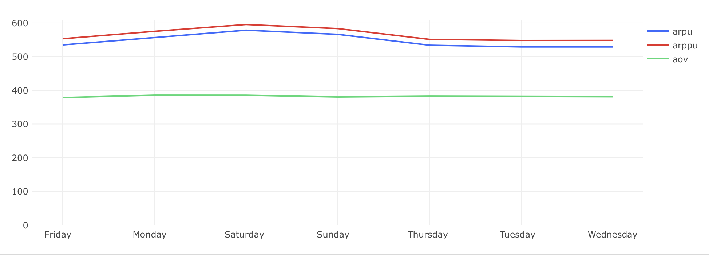

# Экономика продукта — Задача 4

## Анализ ARPU, ARPPU и AOV по дням недели

---

## Задача

Рассчитать ключевые экономические метрики в разрезе **дней недели**:

- **ARPU** — средняя выручка на пользователя.
- **ARPPU** — средняя выручка на платящего пользователя.
- **AOV** — средний чек (выручка на заказ).

### Условия:
- Рассматриваются только данные **с 26 августа 2022 по 8 сентября 2022**.
- Учитывается одинаковое количество всех дней недели (по 2 дня).
- Учитываются только **неотменённые заказы**.
- Платящими считаются пользователи, оформившие хотя бы один неотменённый заказ.

### Требуемые поля:
- `weekday` — наименование дня недели (например, Monday).
- `weekday_number` — порядковый номер (1 = Monday, ..., 7 = Sunday).
- `arpu`, `arppu`, `aov` — округлены до двух знаков.

---

## SQL-запрос

```sql
WITH total_users_t AS (
    SELECT to_char(time, 'Day') AS weekday,
           date_part('isodow', time) AS weekday_number,
           COUNT(DISTINCT user_id) AS total_users
    FROM user_actions
    WHERE time BETWEEN '2022-08-26' AND '2022-09-08'
    GROUP BY weekday, weekday_number
),
paying_users_t AS (
    SELECT to_char(time, 'Day') AS weekday,
           date_part('isodow', time) AS weekday_number,
           COUNT(DISTINCT user_id) AS paying_users
    FROM user_actions
    WHERE order_id NOT IN (
        SELECT order_id FROM user_actions WHERE action = 'cancel_order'
    )
    AND action = 'create_order'
    AND time BETWEEN '2022-08-26' AND '2022-09-08'
    GROUP BY weekday, weekday_number
),
orders_product_id AS (
    SELECT creation_time,
           order_id,
           unnest(product_ids) AS product_id
    FROM orders
    WHERE order_id NOT IN (
        SELECT order_id FROM user_actions WHERE action = 'cancel_order'
    )
    AND creation_time BETWEEN '2022-08-26' AND '2022-09-08'
),
revenue_t AS (
    SELECT weekday,
           weekday_number,
           SUM(order_price) AS revenue,
           COUNT(DISTINCT order_id) AS orders
    FROM (
        SELECT to_char(creation_time, 'Day') AS weekday,
               date_part('isodow', creation_time) AS weekday_number,
               order_id,
               SUM(price) AS order_price
        FROM (
            SELECT creation_time,
                   order_id,
                   l.product_id,
                   price
            FROM orders_product_id AS l
            LEFT JOIN products AS r ON l.product_id = r.product_id
        ) t1
        GROUP BY weekday, weekday_number, order_id
    ) t2
    GROUP BY weekday, weekday_number
)
SELECT l.weekday,
       l.weekday_number,
       ROUND(revenue::decimal / total_users, 2) AS arpu,
       ROUND(revenue::decimal / paying_users, 2) AS arppu,
       ROUND(revenue::decimal / orders, 2) AS aov
FROM revenue_t AS l
JOIN total_users_t AS r ON l.weekday_number = r.weekday_number
JOIN paying_users_t AS r2 ON l.weekday_number = r2.weekday_number
ORDER BY weekday_number;
```

## Визуализация



## Выводы

- ARPU и ARPPU достигают пика в выходные дни (Saturday и Sunday), что отражает рост потребления в свободное от работы время.
- AOV (средний чек) остаётся стабильным во все дни недели, независимо от поведения ARPU/ARPPU.
- Разница между ARPU и ARPPU говорит о доле неплатящих пользователей: чем больше разница, тем больше таких пользователей.
- Такое поведение может говорить о сезонности потребления — пользователи охотнее совершают покупки в выходные, но размер среднего заказа не меняется.
