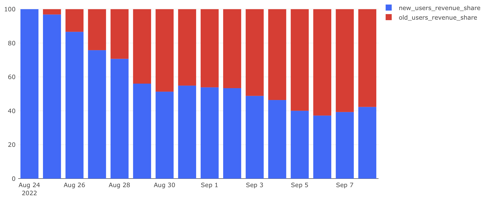

# Экономика продукта — Задача 5

## Выручка от новых пользователей

---

## Задача

Рассчитать ежедневную выручку и определить, **какая её доля приходится на новых пользователей**, а какая — на уже существующих.

---

## Требовалось рассчитать:

- **revenue** — общая выручка за день
- **new_users_revenue** — выручка от новых пользователей
- **new_users_revenue_share** — доля выручки от новых пользователей
- **old_users_revenue_share** — доля выручки от старых пользователей

---

## Подход

- **Новыми пользователями** считаются те, кто впервые совершил действие в сервисе в текущий день.
- Для подсчёта выручки учитываются только **неотменённые заказы**.

---

## SQL-запрос

```sql
WITH revenue_t AS (
    SELECT creation_time::date AS date,
           COUNT(order_id) AS orders,
           SUM(price) AS revenue
    FROM (
        SELECT creation_time,
               order_id,
               unnest(product_ids) AS product_id
        FROM orders
        WHERE order_id NOT IN (
            SELECT order_id FROM user_actions WHERE action = 'cancel_order'
        )
    ) AS o
    LEFT JOIN products AS p ON o.product_id = p.product_id
    GROUP BY date
),
new_users_revenue_t AS (
    SELECT start_date,
           SUM(order_price) AS new_users_revenue
    FROM (
        SELECT user_id,
               start_date,
               t3.order_id,
               order_price
        FROM (
            SELECT t1.user_id,
                   t1.start_date,
                   COALESCE(t2.order_id, 0) AS order_id
            FROM (
                SELECT user_id,
                       MIN(time::date) AS start_date
                FROM user_actions
                GROUP BY user_id
            ) t1
            LEFT JOIN (
                SELECT user_id,
                       time::date AS date,
                       order_id
                FROM user_actions
                WHERE order_id NOT IN (
                    SELECT order_id FROM user_actions WHERE action = 'cancel_order'
                )
            ) t2 ON t1.user_id = t2.user_id AND t1.start_date = t2.date
        ) t3
        LEFT JOIN (
            SELECT order_id,
                   SUM(price) AS order_price
            FROM (
                SELECT p1.order_id,
                       p1.product_id,
                       price
                FROM (
                    SELECT order_id,
                           unnest(product_ids) AS product_id
                    FROM orders
                ) p1
                LEFT JOIN products p2 ON p1.product_id = p2.product_id
            ) p3
            GROUP BY order_id
        ) p4 ON t3.order_id = p4.order_id
    ) t5
    GROUP BY start_date
)
SELECT date,
       revenue,
       new_users_revenue,
       ROUND(new_users_revenue::numeric / revenue * 100, 2) AS new_users_revenue_share,
       ROUND((revenue - new_users_revenue)::numeric / revenue * 100, 2) AS old_users_revenue_share
FROM revenue_t r1
LEFT JOIN new_users_revenue_t r2 ON r1.date = r2.start_date
ORDER BY date;
```

## Визуализация



## Выводы

- В первые дни после запуска сервиса основную выручку генерировали новые пользователи.
- Постепенно происходит снижение доли выручки от новых пользователей — это ожидаемо, так как база старых клиентов увеличивается.
- Стабильный рост доли выручки от старых пользователей говорит о хорошем удержании и повторных заказах.
- Даже через 2 недели более 40% выручки приносили новички — это может указывать на активные маркетинговые кампании и непрерывный приток новых клиентов.

⸻
