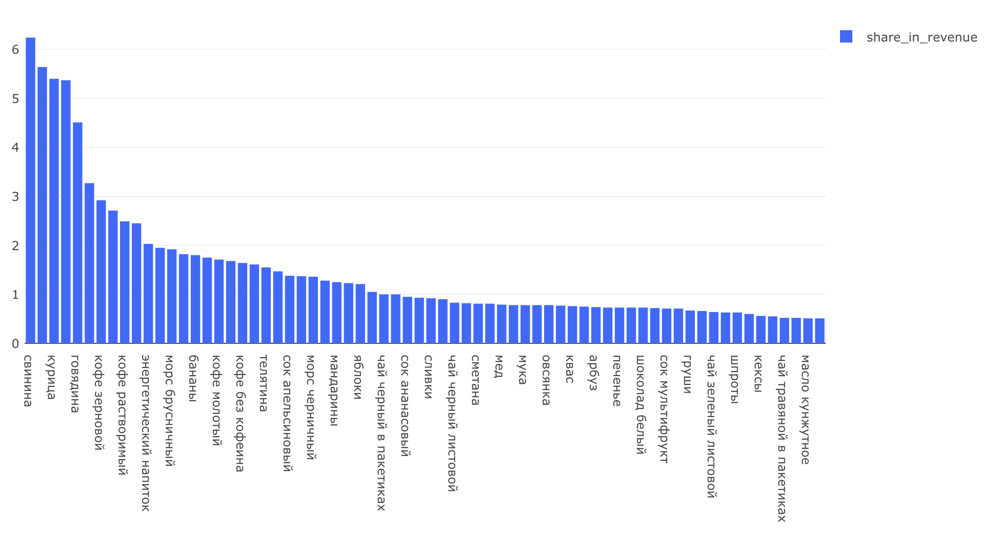

# Экономика продукта — Задача 6

## Самые прибыльные товары

---

## Задача

Посчитать, **какие товары приносят наибольшую выручку**, и какая **доля от общей выручки** приходится на каждый товар.

---

## Требовалось рассчитать:

- `product_name` — наименование товара
- `revenue` — общая выручка с продаж товара
- `share_in_revenue` — доля товара в общей выручке, в процентах

Все товары с долей < 0.5% объединяются в одну группу **"ДРУГОЕ"**.

---

## Подход

- Исключаем **отменённые заказы**
- Сначала рассчитываем общую выручку, затем долю каждого товара
- Доли округляем до двух знаков после запятой

---

## SQL-запрос

```sql
WITH main_t AS (
    SELECT order_id,
           t1.product_id,
           name,
           price
    FROM (
        SELECT order_id,
               unnest(product_ids) AS product_id
        FROM orders
        WHERE order_id NOT IN (
            SELECT order_id FROM user_actions WHERE action = 'cancel_order'
        )
    ) t1
    LEFT JOIN products p USING (product_id)
),
all_revenue AS (
    SELECT SUM(price) AS all_revenue
    FROM main_t
),
revenue_t AS (
    SELECT name,
           SUM(price) AS revenue
    FROM main_t
    GROUP BY name
)
SELECT product_name,
       SUM(revenue) AS revenue,
       SUM(share_in_revenue) AS share_in_revenue
FROM (
    SELECT CASE
               WHEN share_in_revenue < 0.5 THEN 'ДРУГОЕ'
               ELSE product_name
           END AS product_name,
           revenue,
           share_in_revenue
    FROM (
        SELECT name AS product_name,
               revenue,
               ROUND(revenue::numeric / (SELECT all_revenue FROM all_revenue) * 100, 2) AS share_in_revenue
        FROM revenue_t
    ) r1
) r2
GROUP BY product_name
ORDER BY revenue DESC;
```
## Визуализация



## Выводы

- Основную выручку дают мясные продукты и кофе:<br>
	•	Свинина, курица, говядина — лидеры в абсолютной выручке <br>
	•	Кофе (зерновой, растворимый, молотый) — уверенно удерживает высокие доли <br>
	•	Если объединить товары по категориям, мясо и кофе безусловно будут в топе


