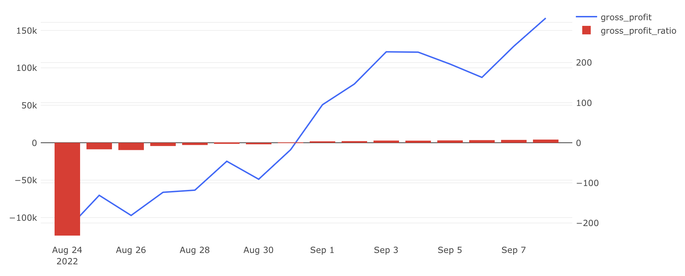

# Экономика продукта — Задача 7

## Расчёт валовой прибыли с учётом затрат и налогов

---

## Задача

Рассчитать **валовую прибыль** с учётом выручки, НДС, затрат на сборку, доставку и аренду.

---

## Требовалось рассчитать:

- `revenue` — выручка за день  
- `costs` — затраты за день  
- `tax` — сумма НДС за день  
- `gross_profit` — валовая прибыль за день  
- `total_revenue` — накопленная выручка  
- `total_costs` — накопленные затраты  
- `total_tax` — накопленный НДС  
- `total_gross_profit` — накопленная валовая прибыль  
- `gross_profit_ratio` — доля валовой прибыли от выручки, %  
- `total_gross_profit_ratio` — доля накопленной прибыли от накопленной выручки, %

---

## Условия расчёта затрат

| Период     | Аренда | Сборка | Доставка | Бонус |
|------------|--------|--------|----------|--------|
| **Август** | 120 000 ₽/день | 140 ₽/заказ | 150 ₽/доставку | 400 ₽ при ≥5 доставок |
| **Сентябрь** | 150 000 ₽/день | 115 ₽/заказ | 150 ₽/доставку | 500 ₽ при ≥5 доставок |

---

## Условия расчёта НДС

НДС:
- 20% — по умолчанию
- 10% — на льготные товары (см. список внутри запроса)

---

## SQL-запрос

```sql
WITH one_table AS (
    SELECT date,
           order_id,
           l.product_id,
           name,
           price,
           SUM(price) OVER (PARTITION BY date) AS revenue,
           CASE
               WHEN name IN (
                   'сахар', 'сухарики', 'сушки', 'семечки', 'масло льняное',
                   'виноград', 'масло оливковое', 'арбуз', 'батон', 'йогурт',
                   'сливки', 'гречка', 'овсянка', 'макароны', 'баранина',
                   'апельсины', 'бублики', 'хлеб', 'горох', 'сметана',
                   'рыба копченая', 'мука', 'шпроты', 'сосиски', 'свинина',
                   'рис', 'масло кунжутное', 'сгущенка', 'ананас', 'говядина',
                   'соль', 'рыба вяленая', 'масло подсолнечное', 'яблоки',
                   'груши', 'лепешка', 'молоко', 'курица', 'лаваш', 'вафли', 'мандарины'
               )
               THEN ROUND(price * 10::NUMERIC / 110, 2)
               ELSE ROUND(price * 20::NUMERIC / 120, 2)
           END AS tax_product
    FROM (
        SELECT creation_time::DATE AS date,
               order_id,
               UNNEST(product_ids) AS product_id
        FROM orders
        WHERE order_id NOT IN (
            SELECT order_id FROM user_actions WHERE action = 'cancel_order'
        )
    ) l
    LEFT JOIN products r ON l.product_id = r.product_id
),
costs_t AS (
    SELECT s_t.date,
           s_t.orders,
           sborka,
           cour_cost,
           sborka + cour_cost AS costs
    FROM (
        SELECT date,
               orders,
               CASE
                   WHEN date < '2022-09-01' THEN orders * 140
                   ELSE orders * 115
               END AS sborka
        FROM (
            SELECT date,
                   COUNT(DISTINCT order_id) AS orders
            FROM one_table
            GROUP BY date
        ) o_t
    ) s_t
    JOIN (
        SELECT date,
               SUM(orders) AS orders,
               SUM(premia) + SUM(dostavka) + MAX(fix_cost) AS cour_cost
        FROM (
            SELECT date,
                   courier_id,
                   orders,
                   CASE
                       WHEN orders >= 5 AND date < '2022-09-01' THEN 400
                       WHEN orders >= 5 AND date >= '2022-09-01' THEN 500
                       ELSE 0
                   END AS premia,
                   orders * 150 AS dostavka,
                   CASE
                       WHEN date < '2022-09-01' THEN 120000
                       ELSE 150000
                   END AS fix_cost
            FROM (
                SELECT time::DATE AS date,
                       courier_id,
                       COUNT(DISTINCT order_id) AS orders
                FROM courier_actions
                WHERE action = 'deliver_order'
                  AND order_id NOT IN (
                      SELECT order_id FROM user_actions WHERE action = 'cancel_order'
                  )
                GROUP BY 1, 2
            ) c_a
        ) c2
        GROUP BY date
    ) c_c ON s_t.date = c_c.date
),
second_t AS (
    SELECT l.date,
           revenue,
           costs,
           tax
    FROM (
        SELECT date,
               MAX(revenue) AS revenue,
               MAX(tax) AS tax
        FROM (
            SELECT date,
                   order_id,
                   product_id,
                   price,
                   name,
                   revenue,
                   tax_product,
                   SUM(tax_product) OVER (PARTITION BY date) AS tax
            FROM one_table
        ) ot
        GROUP BY date
    ) l
    JOIN costs_t r ON l.date = r.date
)
SELECT date,
       revenue,
       costs,
       tax,
       revenue - costs - tax AS gross_profit,
       SUM(revenue) OVER (ORDER BY date) AS total_revenue,
       SUM(costs) OVER (ORDER BY date) AS total_costs,
       SUM(tax) OVER (ORDER BY date) AS total_tax,
       SUM(revenue - costs - tax) OVER (ORDER BY date) AS total_gross_profit,
       ROUND((revenue - costs - tax)::NUMERIC / revenue * 100, 2) AS gross_profit_ratio,
       ROUND(
           (SUM(revenue - costs - tax) OVER (ORDER BY date))::NUMERIC
           / SUM(revenue) OVER (ORDER BY date) * 100,
           2
       ) AS total_gross_profit_ratio
FROM second_t
ORDER BY date;
```

## Визуализация



## Выводы

- Сервис впервые показал положительную ежедневную валовую прибыль с 1 сентября
- К 2 сентября накопленная валовая прибыль стала положительной — сервис вышел в «плюс»
- Оптимизация затрат на сборку в сентябре помогла улучшить прибыльность
