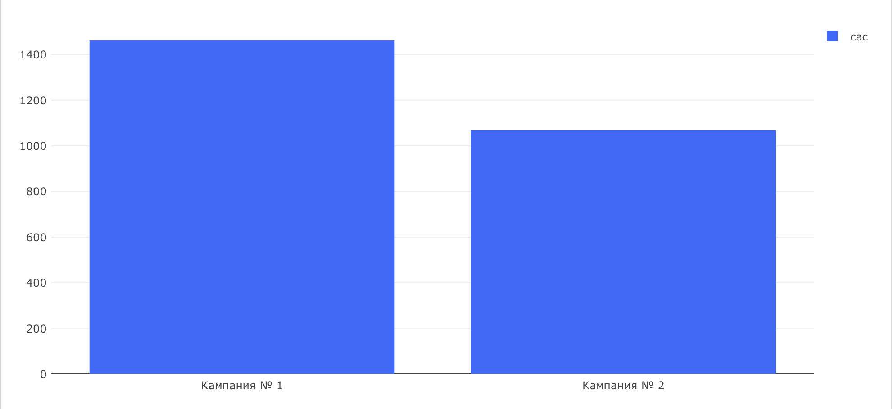

# Маркетинговые метрики — Задача 1

## CAC (Customer Acquisition Cost)

---

## Задача

Оценить эффективность двух рекламных кампаний через метрику **CAC** — среднюю стоимость привлечения одного покупателя.

---

## Дано

| Кампания       | Бюджет       | Зарегистрировались | 
|----------------|--------------|---------------------|
| Кампания № 1   | 250 000 ₽    | 171 человек         |
| Кампания № 2   | 250 000 ₽    | 236 человек         |

**Покупателями считаем пользователей, совершивших хотя бы один неотменённый заказ.**

---

## Метрика

**CAC = Бюджет / Кол-во покупателей**

---

## SQL-запрос

```sql
WITH campain_t AS (
    SELECT 
        CASE 
            WHEN user_id IN (...) THEN 'Кампания № 1'
            WHEN user_id IN (...) THEN 'Кампания № 2'
            ELSE 'Other' 
        END AS ads_campaign,
        user_id
    FROM (
        SELECT DISTINCT user_id
        FROM user_actions
        WHERE order_id NOT IN (
            SELECT order_id
            FROM user_actions
            WHERE action = 'cancel_order'
        )
    ) t1
)
SELECT 
    ads_campaign,
    ROUND(250000 / users_count::NUMERIC, 2) AS cac
FROM (
    SELECT 
        ads_campaign,
        COUNT(user_id) AS users_count
    FROM campain_t
    WHERE ads_campaign IN ('Кампания № 1', 'Кампания № 2')
    GROUP BY ads_campaign
) t2
ORDER BY cac DESC;
```

## Визуализация



## Выводы

- Кампания № 2 оказалась эффективнее: при одинаковом бюджете она привлекла больше покупателей.

