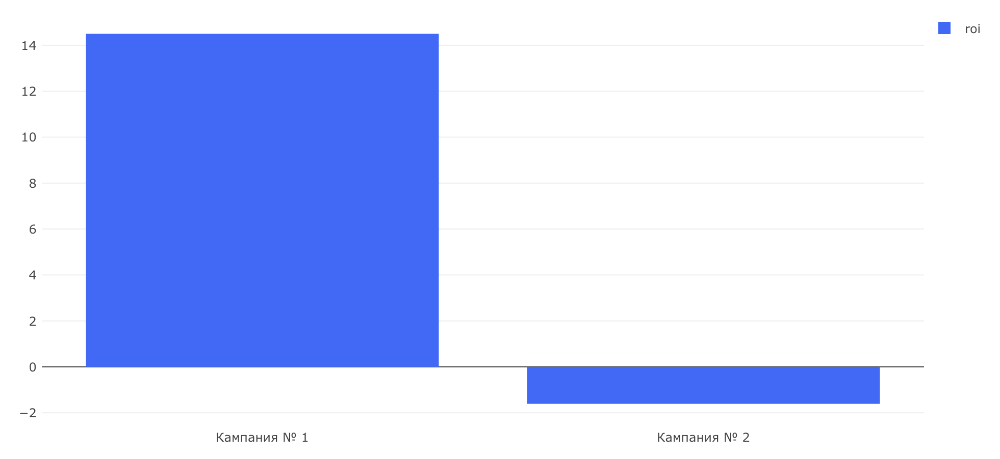

# Маркетинговые метрики — Задача 2

## ROI (Return on Investment)

---

## Задача

Рассчитать метрику **ROI** — рентабельность инвестиций — для двух рекламных кампаний, чтобы понять, какая из них действительно **окупает себя** и приносит прибыль.

---

## Формула

**ROI = (Доход − Расход) / Расход × 100%**

---

## SQL-запрос

```sql
WITH prices AS (
    SELECT order_id, SUM(price) AS order_price
    FROM (
        SELECT order_id, price
        FROM (
            SELECT order_id, unnest(product_ids) AS product_id
            FROM orders
        ) l
        LEFT JOIN products r ON l.product_id = r.product_id
    ) orders_price
    GROUP BY order_id
), campain_t AS (
    SELECT
        CASE 
            WHEN user_id IN (...) THEN 'Кампания № 1'
            WHEN user_id IN (...) THEN 'Кампания № 2'
            ELSE 'Other'
        END AS ads_campaign,
        user_id,
        order_id
    FROM (
        SELECT DISTINCT user_id, order_id
        FROM user_actions
        WHERE order_id NOT IN (
            SELECT order_id
            FROM user_actions
            WHERE action = 'cancel_order'
        )
    ) t1
)
SELECT
    ads_campaign,
    ROUND((SUM(order_price) - 250000)::NUMERIC / 250000 * 100, 2) AS roi
FROM (
    SELECT
        c.ads_campaign,
        c.user_id,
        c.order_id,
        p.order_price
    FROM campain_t c
    LEFT JOIN prices p ON c.order_id = p.order_id
) t3
WHERE ads_campaign != 'Other'
GROUP BY ads_campaign
ORDER BY roi DESC;
```

## Визуализация



## Выводы

- Несмотря на высокий CAC, Кампания № 1 показала положительное значение ROI: она окупается и приносит прибыль.
- Кампания № 2 убыточна: ROI < 0, значит доход от привлечённых пользователей не покрыл рекламные затраты.
