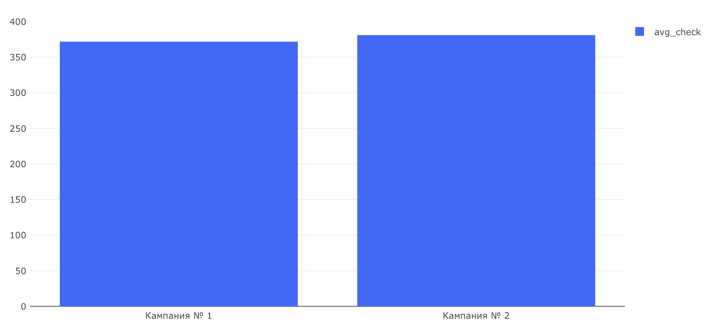

# Маркетинговые метрики — Задача 3

## Средний чек (Average Check) пользователей из разных рекламных кампаний

---

## Задача

Рассчитать **среднюю стоимость заказа** за первую неделю после регистрации (1–7 сентября 2022 года) для пользователей из двух рекламных кампаний:

- **Кампания № 1** — блогер на YouTube
- **Кампания № 2** — таргетированная реклама

---

## Цель

Понять, **чем отличаются пользователи** по своему поведению: возможно, **у одной группы выше средний чек**, что объясняет большую прибыльность кампании.

---

## SQL-запрос

```sql
WITH check_t AS (
    SELECT order_id, SUM(price) AS check_order
    FROM (
        SELECT order_id, unnest(product_ids) AS product_id
        FROM orders
    ) o
    LEFT JOIN products p USING (product_id)
    GROUP BY order_id
), users AS (
    SELECT time::date AS date,
           user_id,
           order_id,
           CASE 
               WHEN user_id IN (...) THEN 'Кампания № 1'
               WHEN user_id IN (...) THEN 'Кампания № 2'
               ELSE 'Other'
           END AS ads_campaign
    FROM user_actions
    WHERE action = 'create_order'
      AND order_id NOT IN (
          SELECT order_id
          FROM user_actions
          WHERE action = 'cancel_order'
      )
      AND time::date BETWEEN '2022-09-01' AND '2022-09-07'
)
SELECT
    ads_campaign,
    ROUND(AVG(avg_ch), 2) AS avg_check
FROM (
    SELECT
        ads_campaign,
        user_id,
        AVG(check_order) AS avg_ch
    FROM (
        SELECT
            ads_campaign,
            user_id,
            check_order
        FROM users u
        LEFT JOIN check_t c USING (order_id)
        WHERE ads_campaign != 'Other'
    ) t1
    GROUP BY ads_campaign, user_id
) t2
GROUP BY ads_campaign
ORDER BY avg_check DESC;
```
## Визуализация



## Выводы

- Кампания № 2 продемонстрировала чуть более высокий средний чек, несмотря на убыточный ROI. Но разница совсем небольшая
