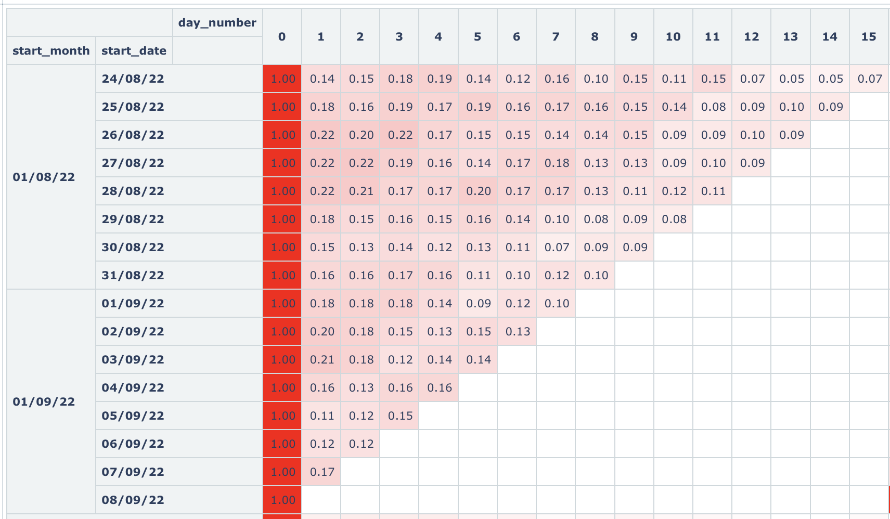

# Маркетинговые метрики — Задача 4

## Анализ дневного Retention по когортам пользователей

---

## Задача

Рассчитать дневной **Retention** — долю пользователей, которые возвращаются в приложение в каждый из дней после первого взаимодействия.

---

## Что считаем?

- **Когорты** — пользователи, впервые взаимодействовавшие с приложением в один и тот же день.
- **retention** — доля пользователей из когорты, вернувшихся в приложение в конкретный день (day_number).
- **start_month** — округлённая дата первого месяца.
- **start_date** — дата первого взаимодействия.
- **day_number** — порядковый номер дня (0, 1, 2...).

---

## SQL-запрос

```sql
SELECT
  to_char((date_trunc('month', start_date)), 'YYYY-MM-DD') AS start_month,
  start_date,
  date_part('day', age(date, start_date))::integer AS day_number,
  round(
    count(DISTINCT user_id)::numeric /
    max(count(DISTINCT user_id)) OVER (PARTITION BY start_date),
    2
  ) AS retention
FROM (
  SELECT
    user_id,
    min(time::date) OVER (PARTITION BY user_id) AS start_date,
    time::date AS date
  FROM user_actions
) t1
GROUP BY start_month, start_date, day_number
ORDER BY start_date, day_number;
```

## Визуализация

<br><br>

Day 0 — всегда 100% (1.00), так как пользователь впервые пришёл в этот день.<br>
Видна постепенная убывающая динамика Retention — пользователи реже возвращаются в последующие дни.<br>
Например, для когорты 24/08/22:<br>
	•	В день 1 вернулось 14% пользователей.<br>
	•	К дню 15 — всего 7%.<br><br>

## Выводы

- Больше всего пользователей теряется на день 1
- Некоторые когорты (например, 26/08, 27/08) показывают более устойчивый Retention — стоит изучить, что было особенного в эти дни.
