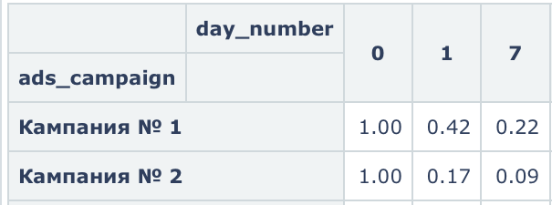

# Маркетинговые метрики — Задача 5

## Retention по рекламным кампаниям

---

## Задача

Посчитать **Retention 1-го и 7-го дня** у пользователей, привлечённых двумя разными рекламными кампаниями.

---

## Что считаем?

- Когорты — пользователи, пришедшие 1 сентября через определённый рекламный канал.
- Retention — доля пользователей, вернувшихся на 1-й и 7-й день после первого взаимодействия.

---

## SQL-запрос

```sql
WITH campain_t AS (
  SELECT
    user_id,
    dt,
    start_date,
    ads_campaign
  FROM (
    SELECT
      user_id,
      time::date AS dt,
      min(time::date) OVER (PARTITION BY user_id) AS start_date,
      CASE
        WHEN user_id IN (<СПИСОК ДЛЯ КАМПАНИИ 1>) THEN 'Кампания № 1'
        WHEN user_id IN (<СПИСОК ДЛЯ КАМПАНИИ 2>) THEN 'Кампания № 2'
        ELSE 'Other'
      END AS ads_campaign
    FROM user_actions
  ) AS u
  WHERE ads_campaign != 'Other'
)
SELECT
  ads_campaign,
  start_date,
  date_part('day', age(dt, start_date))::integer AS day_number,
  round(
    count(DISTINCT user_id)::numeric /
    max(count(DISTINCT user_id)) OVER (PARTITION BY ads_campaign, start_date),
    2
  ) AS retention
FROM campain_t
WHERE date_part('day', age(dt, start_date))::integer IN (0, 1, 7)
GROUP BY ads_campaign, start_date, day_number
ORDER BY ads_campaign, day_number;
```

## Визуализация



## Выводы

- Кампания № 1 показывает существенно лучший Retention:<br>
	•	На 1-й день вернулось 42%, тогда как у второй кампании — только 17%.<br>
	•	На 7-й день сохраняется 22% от когорты, в то время как у второй — 9%.<br>
- Это подтверждает предыдущие метрики:<br>
	•	У кампании № 1 выше ROI и теперь — удержание.<br>
	•	Пользователи из кампании № 1 более вовлечённые.
