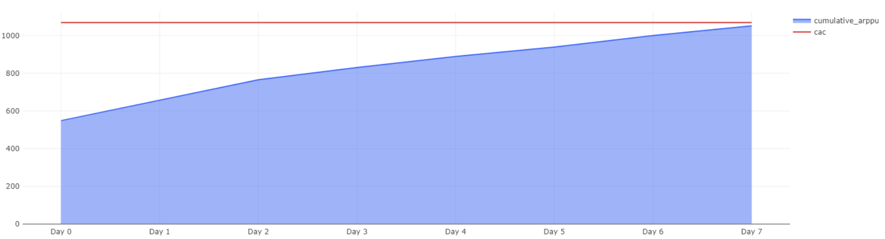

# Маркетинговые метрики — Задача 6

## Когда окупилась реклама?

---

## Задача

Оценить эффективность двух рекламных кампаний с помощью сравнения **накопительного ARPPU** и **CAC**.

---

## Что считаем?

- Для каждой рекламной кампании:
  - **Накопительный ARPPU** — сумма выручки от покупателей / число покупателей.
  - **CAC** — расходы на привлечение одного покупателя (константа для каждого дня).
- Цель — определить **день**, когда накопительный ARPPU превысил CAC.

---

## Алгоритм расчёта

- Выручка суммируется по дням.
- Количество покупателей в когорте остаётся фиксированным.
- CAC = 250 000 / количество покупателей по кампании.

---

## SQL-запрос

```sql
WITH kompain AS (
  -- Определяем заказы, даты и источник привлечения (две кампании)
  SELECT
    order_id,
    date(time) AS dt,
    user_id,
    CASE
      WHEN user_id IN (<СПИСОК_КАМПАНИЯ_1>) THEN 'Кампания № 1'
      WHEN user_id IN (<СПИСОК_КАМПАНИЯ_2>) THEN 'Кампания № 2'
      ELSE 'other'
    END AS ads_campaign
  FROM user_actions
  WHERE order_id NOT IN (
    SELECT order_id
    FROM user_actions
    WHERE action = 'cancel_order'
  )
),
revenue AS (
  -- Считаем выручку по заказам
  SELECT
    order_id,
    SUM(price) AS order_revenue
  FROM products
  JOIN (
    SELECT order_id, UNNEST(product_ids) AS product_id
    FROM orders
    WHERE order_id IN (SELECT order_id FROM kompain)
  ) AS t2 USING (product_id)
  GROUP BY order_id
)
-- Финальный расчёт накопительного ARPPU и CAC
SELECT
  ads_campaign,
  CONCAT('Day ', da) AS day,
  cumulative_arppu,
  cac
FROM (
  SELECT
    ads_campaign,
    dt - MIN(dt) OVER (PARTITION BY ads_campaign) AS da,
    ROUND(SUM(revenue_in_date) OVER (PARTITION BY ads_campaign ORDER BY dt), 2) AS cumulative_arppu,
    cac
  FROM (
    SELECT
      ads_campaign,
      dt,
      SUM(order_revenue) / count_users_kompains AS revenue_in_date,
      ROUND(250000 / count_users_kompains::decimal, 2) AS cac
    FROM revenue
    JOIN kompain k USING (order_id)
    JOIN (
      SELECT
        ads_campaign,
        COUNT(DISTINCT user_id) AS count_users_kompains
      FROM kompain
      GROUP BY ads_campaign
    ) AS coun USING (ads_campaign)
    GROUP BY ads_campaign, dt, count_users_kompains
    ORDER BY ads_campaign, dt
  ) AS t3
) AS t4
```
## Визуализация

**Кампания 1:**


**Кампания 2:**




## Выводы

- Кампания № 1:<br>
	•	Накопительный ARPPU пересёк CAC примерно на 6-й день.<br>
	•	Это значит, что вложения в рекламу начали окупаться уже через неделю.<br>
	•	Кривая продолжает уверенно расти выше уровня CAC.<br>
- Кампания № 2:<br>
	•	ARPPU не дотянулся до CAC даже на 7-й день.<br>
	•	Это указывает на низкую эффективность этого канала привлечения.<br>
	•	Пользователи из второй кампании менее активны.<br>
