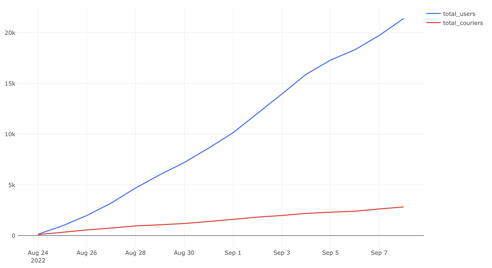

# Рост аудитории сервиса

## Задача

Нужно проанализировать, насколько быстро растёт аудитория сервиса доставки:

- определить, сколько новых пользователей и курьеров приходит каждый день;
- оценить стабильность притока.

**Требовалось рассчитать:**

- `new_users` — число новых пользователей в день;
- `new_couriers` — число новых курьеров в день;
- `total_users` — общее число пользователей к текущей дате;
- `total_couriers` — общее число курьеров к текущей дате.

## Подход

Новым считается пользователь/курьер, впервые совершивший действие в системе. Для подсчёта общего числа используется оконная функция `SUM() OVER`.

## SQL-запрос

```sql
SELECT users_t.date as date,
       new_users,
       new_couriers,
       total_users,
       total_couriers
FROM   (
    SELECT date,
           new_users,
           SUM(new_users) OVER (ORDER BY date)::integer as total_users
    FROM (
        SELECT MIN(time)::date as date,
               COUNT(user_id) as new_users
        FROM user_actions
        GROUP BY user_id
    ) t1
    GROUP BY date
) as users_t
FULL JOIN (
    SELECT date,
           new_couriers,
           SUM(new_couriers) OVER (ORDER BY date)::integer as total_couriers
    FROM (
        SELECT MIN(time)::date as date,
               COUNT(courier_id) as new_couriers
        FROM courier_actions
        GROUP BY courier_id
    ) t2
    GROUP BY date
) as couriers_t
ON users_t.date = couriers_t.date
```


## Визуализация

**Динамика новых пользователей и курьеров:**


**Рост общего числа пользователей и курьеров:**



## Выводы

- Количество новых пользователей растёт быстрее, чем курьеров.
- Приток курьеров стабилен
- Кумулятивные графики показывают, что общее число пользователей заметно превышает число курьеров.


