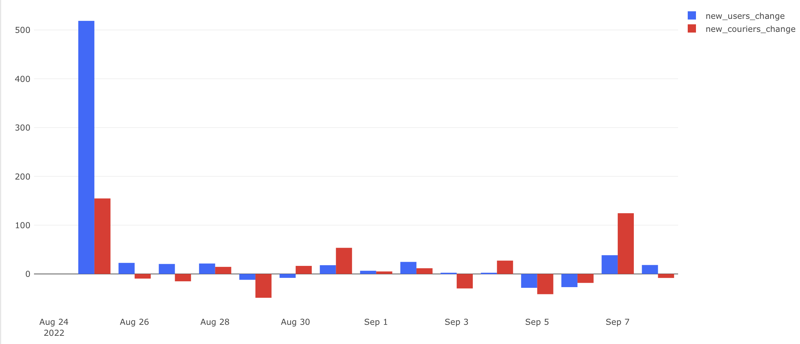
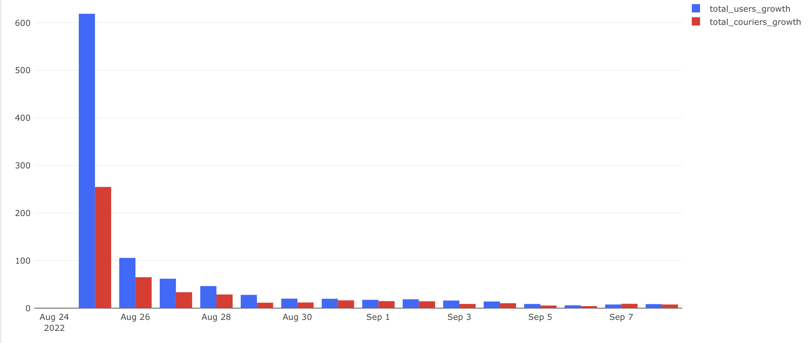

# Динамика роста аудитории в процентах

## Задача

Продолжая анализ роста аудитории сервиса, необходимо перейти от абсолютных значений к относительным. Это поможет оценить:

- темпы прироста новых пользователей и курьеров;
- стабильность роста;
- пики или провалы в динамике.

## Требовалось рассчитать:

- `new_users_change` — прирост числа новых пользователей (%);
- `new_couriers_change` — прирост числа новых курьеров (%);
- `total_users_growth` — прирост общего числа пользователей (%);
- `total_couriers_growth` — прирост общего числа курьеров (%).

## Подход

- Использована оконная функция `LAG()` для получения предыдущих значений.
- Вычисления выполнены в процентах с округлением до двух знаков.
- Визуализации оформлены в виде bar-чартов, где хорошо видно как колебания, так и общую динамику.

## SQL-запрос

```sql
SELECT users_t.date as date,
       new_users,
       new_couriers,
       total_users,
       total_couriers,
       round(((new_users - lag(new_users) OVER (ORDER BY users_t.date))::numeric /lag(new_users) OVER (ORDER BY users_t.date)*100), 2) as new_users_change,
       round(((new_couriers - lag(new_couriers) OVER (ORDER BY users_t.date))::numeric /lag(new_couriers) OVER (ORDER BY users_t.date)*100), 2) as new_couriers_change,
       round(((total_users - lag(total_users) OVER (ORDER BY users_t.date))::numeric /lag(total_users) OVER (ORDER BY users_t.date)*100), 2) as total_users_growth,
       round(((total_couriers - lag(total_couriers) OVER (ORDER BY users_t.date))::numeric /lag(total_couriers) OVER (ORDER BY users_t.date)*100), 2) as total_couriers_growth
FROM (
    SELECT date,
           new_users,
           sum(new_users) OVER (ORDER BY date)::integer as total_users
    FROM (
        SELECT first_time::date as date,
               count(user_id) as new_users
        FROM (
            SELECT user_id,
                   min(time) as first_time
            FROM user_actions
            GROUP BY user_id
        ) t1
        GROUP BY date
    ) t2
) AS users_t
FULL JOIN (
    SELECT date,
           new_couriers,
           sum(new_couriers) OVER (ORDER BY date)::integer as total_couriers
    FROM (
        SELECT first_time::date as date,
               count(courier_id) as new_couriers
        FROM (
            SELECT courier_id,
                   min(time) as first_time
            FROM courier_actions
            GROUP BY courier_id
        ) t3
        GROUP BY date
    ) t4
) AS couriers_t
ON users_t.date = couriers_t.date
```

## Визуализация

**Прирост новых пользователей и курьеров (в процентах)**



**Прирост общего числа пользователей и курьеров (в процентах):**



## Выводы

- В первый день наблюдается резкий прирост — это эффект начала периода анализа.
- Далее динамика выравнивается, но остаётся нестабильной, особенно у новых пользователей.
- Курьеры растут более умеренно и равномерно, без значительных скачков.
- Показатели прироста помогают выявить дни, где произошли изменения в пользовательской или логистической активности.
