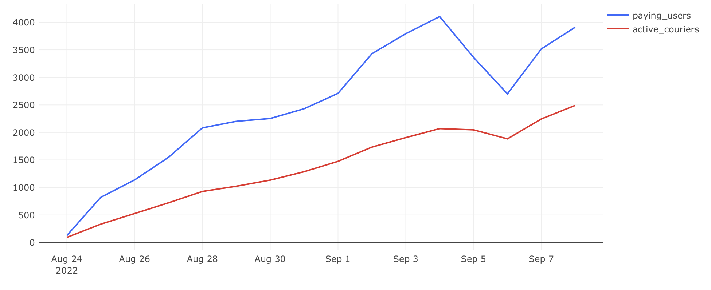
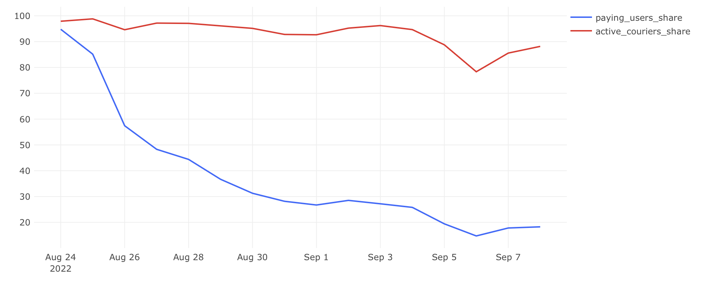

# Активные пользователи и курьеры

## Задача

Нужно проанализировать активную часть аудитории сервиса: не всех пользователей и курьеров, а только тех, кто выполняет целевое действие — оформляет или доставляет заказы.

**Нужно определить:**

- сколько пользователей действительно совершают покупки (платящие);
- сколько курьеров участвуют в выполнении заказов (активные);
- какую долю составляют активные от общего количества.

## Требовалось рассчитать:

- `paying_users` — число платящих пользователей;
- `active_couriers` — число активных курьеров;
- `paying_users_share` — доля платящих от общего числа пользователей;
- `active_couriers_share` — доля активных курьеров от общего числа курьеров.

## Подход

- Платящими считаем пользователей, которые **оформили заказ**, не отменённый впоследствии.
- Активные курьеры — те, кто **принял или доставил** хотя бы один неотменённый заказ.
- Доли рассчитываются как отношение к общему числу пользователей/курьеров на текущую дату (накапливались в предыдущих задачах).
- Используются оконные функции и объединение трёх подзапросов.

## SQL-запрос

```sql
SELECT paying_t.date,
       paying_users,
       active_couriers,
       round(paying_users::numeric / total_users::numeric * 100, 2) as paying_users_share,
       round(active_couriers::numeric / total_couriers * 100, 2) as active_couriers_share
FROM (
    SELECT time::date as date,
           count(distinct user_id) as paying_users
    FROM user_actions
    WHERE order_id NOT IN (
        SELECT order_id
        FROM user_actions
        WHERE action = 'cancel_order'
    )
      AND action = 'create_order'
    GROUP BY date
) paying_t
LEFT JOIN (
    SELECT users_t.date as date,
           new_users,
           new_couriers,
           total_users,
           total_couriers
    FROM (
        SELECT date,
               new_users,
               sum(new_users) OVER (ORDER BY date)::int as total_users
        FROM (
            SELECT min(time)::date as date,
                   count(user_id) as new_users
            FROM user_actions
            GROUP BY user_id
        ) t1
        GROUP BY date
    ) users_t
    FULL JOIN (
        SELECT min(time)::date as date,
               count(courier_id) as new_couriers,
               sum(count(courier_id)) OVER (ORDER BY min(time)::date)::int as total_couriers
        FROM courier_actions
        GROUP BY courier_id
    ) couriers_t
    ON users_t.date = couriers_t.date
) total_t
ON paying_t.date = total_t.date
LEFT JOIN (
    SELECT time::date as date,
           count(distinct courier_id) as active_couriers
    FROM courier_actions
    WHERE order_id NOT IN (
        SELECT order_id
        FROM user_actions
        WHERE action = 'cancel_order'
    )
      AND (action = 'accept_order' OR action = 'deliver_order')
    GROUP BY date
) active_t
ON paying_t.date = active_t.date
ORDER BY date;
```


## Визуализация

**Динамика платящих пользователей и активных курьеров:**



**Динамика долей платящих пользователей и активных курьеров:**



## Выводы

- Число платящих пользователей и активных курьеров растёт синхронно с общим числом.
- Доля платящих держится в пределах нормы, при этом активные курьеры чаще составляют меньшую долю от всех.
- Это может говорить о необходимости перераспределения нагрузки или об оптимизации числа курьеров.
