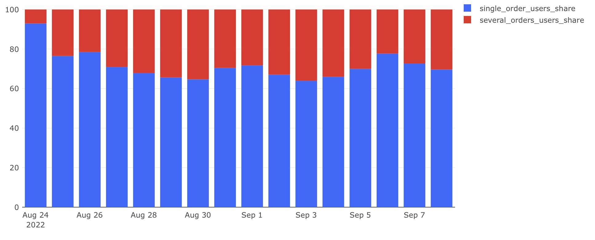

# Повторные заказы пользователей

## Задача

Нужно оценить поведение платящих пользователей: насколько часто они совершают повторные заказы в течение одного дня. Это поможет понять уровень вовлечённости и удовлетворённости продуктом.

**Нужно определить:**

- долю пользователей, совершивших только один заказ в день;
- долю пользователей, совершивших несколько заказов в день.

## Требовалось рассчитать:

- `single_order_users_share` — доля пользователей с одним заказом;
- `several_orders_users_share` — доля пользователей с двумя и более заказами;
- `date` — день активности.

## Подход

- Пользователь считается платящим, если в этот день он создал хотя бы один заказ, который не был отменён.
- Расчёт проводится по отношению к общему числу платящих пользователей за день.
- Используются `GROUP BY date, user_id`, фильтрация по числу заказов и агрегация по количеству пользователей.

## SQL-запрос

```sql
SELECT date,
       round(single_order::numeric / paying_users * 100, 2) as single_order_users_share,
       round(several_orders::numeric / paying_users * 100, 2) as several_orders_users_share
FROM (
    SELECT paying_t.date as date,
           paying_users,
           single_order,
           several_orders
    FROM (
        SELECT time::date as date,
               count(distinct user_id) as paying_users
        FROM user_actions
        WHERE order_id NOT IN (
            SELECT order_id FROM user_actions WHERE action = 'cancel_order'
        )
          AND action = 'create_order'
        GROUP BY date
    ) paying_t
    LEFT JOIN (
        SELECT date,
               count(user_id) as single_order
        FROM (
            SELECT time::date as date,
                   user_id,
                   count(distinct order_id) as orders_count
            FROM user_actions
            WHERE order_id NOT IN (
                SELECT order_id FROM user_actions WHERE action = 'cancel_order'
            )
              AND action = 'create_order'
            GROUP BY date, user_id
        ) t1
        WHERE orders_count = 1
        GROUP BY date
    ) singl_t ON paying_t.date = singl_t.date
    LEFT JOIN (
        SELECT date,
               count(user_id) as several_orders
        FROM (
            SELECT time::date as date,
                   user_id,
                   count(distinct order_id) as orders_count
            FROM user_actions
            WHERE order_id NOT IN (
                SELECT order_id FROM user_actions WHERE action = 'cancel_order'
            )
              AND action = 'create_order'
            GROUP BY date, user_id
        ) t1
        WHERE orders_count > 1
        GROUP BY date
    ) several_t ON paying_t.date = several_t.date
) main_t
ORDER BY date;
```

## Визуализация

**Доли пользователей с одним и несколькими заказами:**



## Выводы

- Основная часть пользователей (65–80%) делает только один заказ в день.
- При этом у 20–35% пользователей встречаются повторные заказы.
- В первый день (24 августа) наблюдается максимальная доля однозаказных пользователей, что может быть связано с небольшой аудиторией или промо-активностью.
