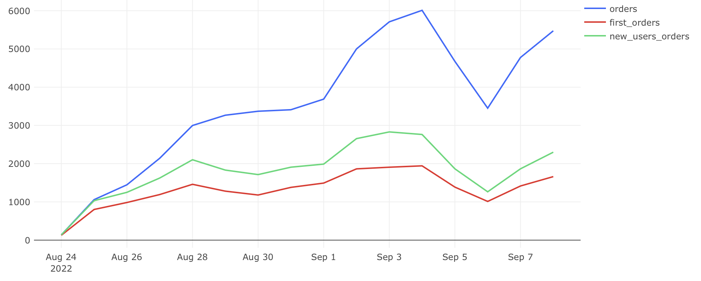
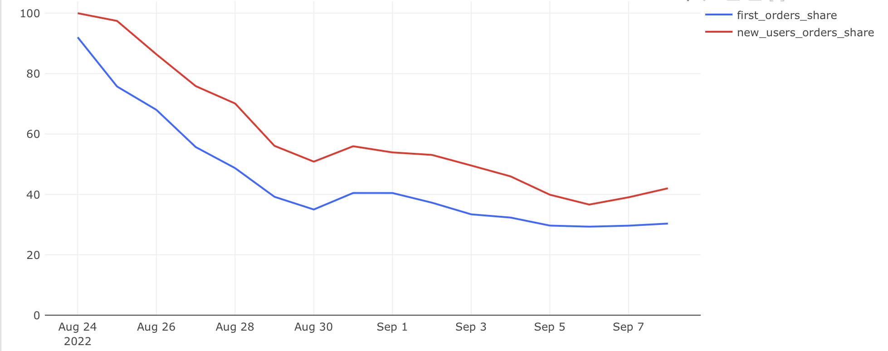

# Заказы: первые, их доля и общее число

## Задача

**Требовалось рассчитать:**

- `orders` — общее количество заказов;
- `first_orders` — число первых заказов (уникальных пользователей в свой первый день);
- `new_users_orders` — число заказов, совершённых в день регистрации;
- `first_orders_share` — доля первых заказов от общего числа;
- `new_users_orders_share` — доля заказов новых пользователей от общего числа.

Цель — понять поведение новых клиентов, вклад новых пользователей в заказы и выявить закономерности по времени.

## Подход

- Выделяем пользователей, совершивших первый заказ.
- Считаем заказы в первый день использования (через first_order_date).
- Удаляем отменённые заказы.
- Объединяем все показатели по дате и считаем доли.

## SQL-запрос

```sql
-- Запрос разбит по CTE для наглядности
WITH first_date_t AS (
  SELECT user_id,
         MIN(time::date) AS first_order_date
  FROM user_actions
  WHERE action = 'create_order'
  GROUP BY user_id
),
users_orders_t AS (
  SELECT user_id,
         time::date AS order_date,
         COUNT(DISTINCT order_id) AS orders_count
  FROM user_actions
  WHERE order_id NOT IN (
    SELECT order_id FROM user_actions WHERE action = 'cancel_order')
    AND action = 'create_order'
  GROUP BY user_id, time::date
),
new_users_orders_t AS (
  SELECT order_date,
         SUM(CASE WHEN u.order_date = f.first_order_date THEN u.orders_count ELSE 0 END) AS new_users_orders
  FROM users_orders_t u
  LEFT JOIN first_date_t f ON u.user_id = f.user_id
  GROUP BY u.order_date
),
first_orders_t AS (
  SELECT MIN(time)::date AS date,
         COUNT(DISTINCT user_id) AS first_orders
  FROM user_actions
  WHERE order_id NOT IN (
    SELECT order_id FROM user_actions WHERE action = 'cancel_order')
  GROUP BY MIN(time)::date
),
orders_t AS (
  SELECT time::date AS date,
         COUNT(DISTINCT order_id) AS orders
  FROM user_actions
  WHERE order_id NOT IN (
    SELECT order_id FROM user_actions WHERE action = 'cancel_order')
  GROUP BY time::date
)
SELECT
  o.date,
  orders,
  first_orders,
  new_users_orders::int,
  ROUND(first_orders::numeric / orders * 100, 2) AS first_orders_share,
  ROUND(new_users_orders::numeric / orders * 100, 2) AS new_users_orders_share
FROM orders_t o
LEFT JOIN first_orders_t f ON o.date = f.date
LEFT JOIN new_users_orders_t n ON o.date = n.order_date
ORDER BY o.date;

```


## Визуализация

**Динамика заказов:**



**Доли заказов:**



## Выводы

- Количество заказов устойчиво растёт, особенно в первые дни.
- Доля первых заказов и заказов новых пользователей постепенно снижается — это может говорить о том, что платящая база становится более постоянной.
- В начале почти все заказы — от новых пользователей, но затем ядро постоянных клиентов начинает расти
