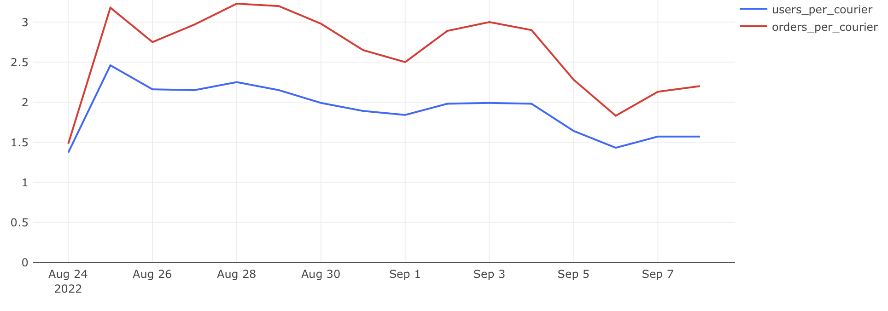

## Нагрузка на курьеров

### Задача

Оценить, насколько эффективно используются курьеры сервиса: сколько пользователей и заказов приходится в среднем на одного активного курьера.

**Необходимо рассчитать:**

- `users_per_courier` — среднее число платящих пользователей на одного активного курьера;
- `orders_per_courier` — среднее число заказов на одного активного курьера;
- `date` — дата.

---

### Подход

- **Платящие пользователи** — те, кто создал хотя бы один неотменённый заказ.
- **Активные курьеры** — те, кто в день либо принял, либо доставил хотя бы один неотменённый заказ.
- Считаем агрегаты по датам и делим пользователей/заказы на курьеров.

---

### SQL-запрос

```sql
WITH active_couriers_t AS (
    SELECT time::date AS date,
           COUNT(DISTINCT courier_id) AS active_couriers
    FROM courier_actions
    WHERE order_id NOT IN (
        SELECT order_id FROM user_actions WHERE action = 'cancel_order')
      AND (action = 'accept_order' OR action = 'deliver_order')
    GROUP BY date
),
paying_users_t AS (
    SELECT time::date AS date,
           COUNT(DISTINCT user_id) AS paying_users
    FROM user_actions
    WHERE order_id NOT IN (
        SELECT order_id FROM user_actions WHERE action = 'cancel_order')
      AND action = 'create_order'
    GROUP BY date
),
orders_t AS (
    SELECT creation_time::date AS date,
           COUNT(DISTINCT order_id) AS orders
    FROM orders
    WHERE order_id NOT IN (
        SELECT order_id FROM user_actions WHERE action = 'cancel_order')
      AND order_id IN (
        SELECT order_id FROM courier_actions WHERE action = 'deliver_order')
    GROUP BY date
)
SELECT l.date,
       ROUND(paying_users::numeric / active_couriers, 2) AS users_per_courier,
       ROUND(orders::numeric / active_couriers, 2) AS orders_per_courier
FROM active_couriers_t l
LEFT JOIN paying_users_t r ON l.date = r.date
LEFT JOIN orders_t r_2 ON l.date = r_2.date;
```
## Визуализация

**Динамика числа пользователей и заказов на одного курьера:**



## Выводы

- На одного курьера в среднем приходится 1.5–2 пользователя и около 2–3 заказов в день.
- Показатели держатся на стабильном уровне, но к концу периода немного снижаются.
- Снижение нагрузки может говорить о том, что количество курьеров растёт быстрее, чем пользовательская активность. 
- При текущей загрузке, возможно, стоит приостановить наращивание числа курьеров, чтобы избежать избыточных затрат.
