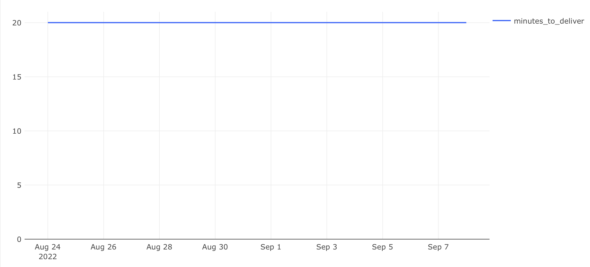

## Среднее время доставки заказов

### Задача

Нужно оценить, насколько оперативно курьеры доставляют заказы.

**Необходимо рассчитать:**

- `minutes_to_deliver` — среднее количество минут от принятия заказа до его доставки;
- `date` — дата фактической доставки заказа.

---

### Условия:

- Учитываются только **доставленные** заказы (`deliver_order`);
- Отменённые заказы исключаются;
- Время рассчитывается как разница между `deliver_order` и `accept_order`;
- За день берётся **среднее** время доставки всех заказов, доставленных в этот день.

---

### SQL-запрос

```sql
SELECT deliver_time::date AS date,
       ROUND(AVG(EXTRACT(EPOCH FROM deliver_time - accept_time) / 60)) AS minutes_to_deliver
FROM (
    SELECT order_id,
           MAX(CASE WHEN action = 'accept_order' THEN time END) AS accept_time,
           MAX(CASE WHEN action = 'deliver_order' THEN time END) AS deliver_time
    FROM courier_actions
    WHERE order_id NOT IN (
        SELECT order_id FROM user_actions WHERE action = 'cancel_order')
    GROUP BY order_id
) t
GROUP BY date
ORDER BY date;
```

## Визуализация

**Динамика среднего времени доставки заказов:**



## Выводы

- Среднее время доставки составляет ровно 20 минут на протяжении всего периода.
