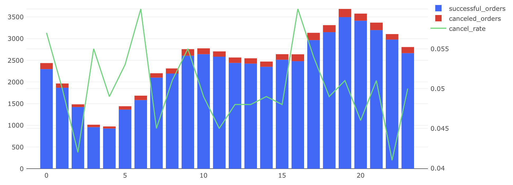

## Почасовая нагрузка и отмены заказов

### Задача

Нужно проанализировать активность пользователей по часам и понять, в какие часы совершается больше всего заказов, а также как часто отменяются заказы.

**Необходимо рассчитать:**

- `successful_orders` — количество доставленных заказов;
- `canceled_orders` — количество отменённых заказов;
- `cancel_rate` — доля отмен (от всех заказов);
- `hour` — час оформления заказа (0–23).

---

### SQL-запрос

```sql
WITH successful_orders_t AS (
    SELECT date_trunc('hour', creation_time) AS hour,
           COUNT(DISTINCT order_id) AS successful_orders
    FROM orders
    WHERE order_id IN (
        SELECT order_id FROM courier_actions WHERE action = 'deliver_order')
      AND order_id NOT IN (
        SELECT order_id FROM user_actions WHERE action = 'cancel_order')
    GROUP BY hour
),
canceled_orders_t AS (
    SELECT date_trunc('hour', creation_time) AS hour,
           COUNT(DISTINCT order_id) AS canceled_orders
    FROM orders
    WHERE order_id IN (
        SELECT order_id FROM user_actions WHERE action = 'cancel_order')
    GROUP BY hour
),
orders_t AS (
    SELECT date_part('hour', creation_time) AS hour,
           COUNT(DISTINCT order_id) AS orders
    FROM orders
    GROUP BY hour
)
SELECT t1.hours AS hour,
       successful_orders,
       canceled_orders,
       ROUND(canceled_orders::numeric / orders, 3) AS cancel_rate
FROM (
    SELECT date_part('hour', l.hour)::integer AS hours,
           SUM(successful_orders)::integer AS successful_orders,
           SUM(canceled_orders)::integer AS canceled_orders
    FROM successful_orders_t l
    LEFT JOIN canceled_orders_t r ON l.hour = r.hour
    GROUP BY hours
) t1
LEFT JOIN orders_t ord ON t1.hours = ord.hour
ORDER BY hour;
```

## Визуализация

**Динамика показателя cancel rate и числа успешных/отменённых заказов:**




## Выводы

- Пиковые часы заказов: с 17:00 до 21:00 — именно в это время наблюдается максимальное число доставленных заказов.
- Минимальная активность — ранним утром (3–6 часов).
- Cancel rate стабилен и колеблется в пределах 4–6%, иногда превышает 6% в ночные или утренние часы.
- Можно предположить, что:<br>
	•	Вечером больше пользователей активно оформляют заказы.<br>
	•	Утром и ночью отмены могут происходить чаще (возможно, из-за меньшего количества доступных курьеров или снижения скорости обработки).
